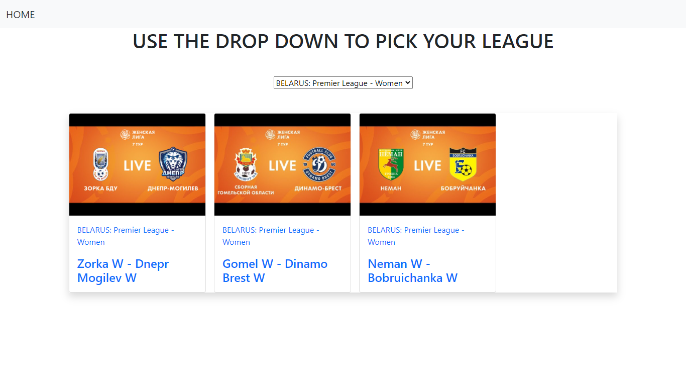

# FOOTBALL HIGHTLIGHTS

This is a React web application where you can navigate through different football categories and watch any football match highlights.

Design belongs to me.

## Live Demo

[View Live Demo](https://nifty-heisenberg-dbdf6e.netlify.app/)

## Screenshots

## Video Presentation

[Visit video presentation](https://www.loom.com/share/979654668b5d46f59f6656f68f8e4398)

## Potential Features

- Search function.
- Add layout for smaller devices.

## Setup

1. Clone this repository and access the project's directory.
2. Run "npm install".
3. Run "npm test" to run the tests.
4. Run "npm start" to work on the development server.

## Built With

- JavaScript/ES6
- Jest
- React
- React Hooks
- React Router
- Redux
- React Redux
- scorebat API
- Netlify

## Author
👤 **RICK OBURU**

- Github: [@RICKCOYL](https://github.com/RICKCOYL)
- Twitter: [@rickcoyl](https://twitter.com/rickcoyl)
- Linkedin: [Rick Oburu](https://www.linkedin.com/in/rickoburu/)

## 🤝 Contributing

Contributions, issues and feature requests are welcome!

Feel free to check the [issues page](https://github.com/RICKCOYL/FOOTBALL-HIGHLIGHTS/issues).

## Show your support

Give a ⭐️ if you like this project!